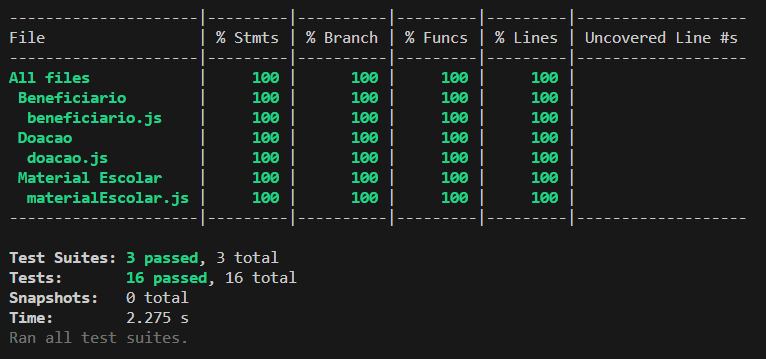
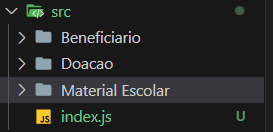
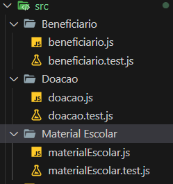

# 📚 Banco de Material Escolar - Projeto Final Reprograma

A ideia do presente projeto foi inspirada no funcionamento do Banco de Alimentos. Qualquer pessoa de qualquer idade que não tenha condições de adquirir material escolar pode se cadastrar para receber os materiais que necessita. O beneficiário pode ser tanto no individual quanto para instituições sociais.

## 💻 Principais tecnologias utilizadas
| Nome    | Documentação   | Versão  |
| ------- | -------------- | ------- |
| Node.js    | https://nodejs.org/en   | 16.13.1  |
| Jest    | https://jestjs.io/pt-BR/   | 29.6.4  |
| Javascript    | https://developer.mozilla.org/pt-BR/docs/Web/JavaScript   |  -  |

## 🔨 Desenvolvimento do Projeto

Para iniciar o desenvolvimento é necessário clonar o projeto do github em um diretório de sua preferência, através do git bash:

```
cd <diretorio_de_sua_preferencia>
git clone https://github.com/NicoleSF/projeto-final-reprograma.git

```

Feito isso, instale as dependências com o seguinte comando:

```
npm install
```

Para rodar as instâncias criadas de cada classe, digite em seu terminal:

```
node index.js
```

## ✏️ Testes

Para rodar os testes da aplicação, digite em seu terminal:

```
npm run test
```

Abaixo, até o presente momento, a cobertura de testes se encontra desta forma:



## 📋 Arquitetura do Projeto

O projeto possui uma pasta src que contém a estrutura do desenvolvimento, conforme é visto na imagem abaixo:



E cada classe tem dois arquivos: o .js com a construção das informações e o test.js com os testes unitários:



## ✅ Futuras Funcionalidades

- Desenvolver a parte do front-end utilizando o typescript e React;
- Desenvolver tela de login para que as instituições e pessoas possam acessar configurações mais específicas;
- Desenvolver tela que mostra os materiais disponíveis;
- Desenvolver tela que permita cadastro de instituições e pessoas para que possam receber suas doações;

## 💜 Agradecimentos:
Todo meu agradecimento à equipe do Reprograma e às colegas de turma pelas vivências, aprendizagem e afeto! <3

## 📧 Contato

- **Github:** [@NicoleSF](https://github.com/NicoleSF)
- **Linkedin:** [Nicole Fagundes](https://www.linkedin.com/in/nicole-siqueira-fagundes/)

## 😊 Autora
<table>
    <tr>
        <td align="center><br /><sub><b>Nicole Fagundes</b></sub></td>
    </tr>
</table>
